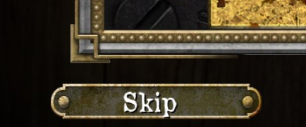

# Puzzleskip

**Puzzleskip** is a mod that allows players to skip puzzles in the Mansions of Madness: Second Edition application. Currently, only the Windows version of the application is supported.

## How to Install
### Step 1: Install BepInEx
BepInEx is a modding framework for Unity games. Follow these steps to install it:

1. Download BepInEx: go to the [BepInEx GitHub page](https://github.com/BepInEx/BepInEx/releases) and download the **x86** version. The **x86** version is required because the Mansions of Madness application is a 32-bit application.  
**Note: Ensure that you download a BepInEx version with a major version of 5, as this mod is only compatible with BepInEx 5.x.x.**
2. Extract BepInEx: extract the contents of the downloaded BepInEx zip file into the root directory of your Mansions of Madness game folder. It is usually `c:\Program Files (x86)\Steam\steamapps\common\Mansions of Madness`.
3. Run the Game: launch the Mansions of Madness application once. This will generate the necessary folders and configuration files needed by BepInEx.

### Step 2: Install Puzzleskip mod

1. Download the DLL file from [the releases page](https://github.com/gwisp2/Puzzleskip/releases). 
2. Copy the downloaded DLL file into the BepInEx/plugins folder inside your Mansions of Madness game directory.

### Step 3: Enjoy
Launch the Mansions of Madness game as usual. The Puzzleskip mod will be active, allowing you to skip puzzles within the game.

## How to Use

To skip a puzzle while playing Mansions of Madness:
1. Hold down the right mouse button for 3 seconds. Skip button appears: the 'Close' button will transform into a 'Skip' button.
2. Click the 'Skip' button to bypass the puzzle and continue with the game.

## Troubleshooting

Log file: `BepInEx\LogOutput.log`   
Please provide its contents when creating an issue.

## For developers

To build this mod you need to copy `Assembly-CSharp.dll` from the game to lib/ directory.
